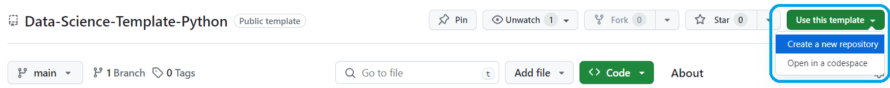
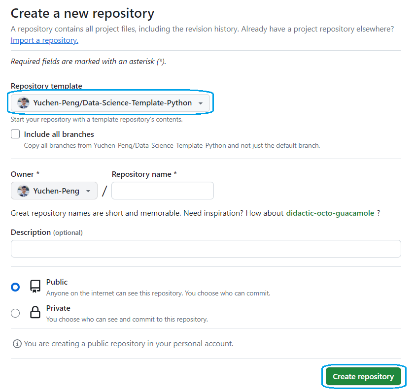

# Data-Science-Template-Python

Maintained by [Yuchen Peng](https://github.com/Yuchen-Peng).

This repo provides a code template for data science &amp; machine learning model development projects in Python. The file structure is optimized to keep code organzied as installable packages.

You can create a new repository based on this template, which will inherit the same directory structure

1. Navigate to the main page of this [repository](https://github.com/Yuchen-Peng/Data-Science-Template-Python/tree/main).

2. Above the file list, click **Use this template**.

3. Select **Create a new repository**.

4. On the next page to enter the repo information, you should see the option **Repository template** is set to use this repo. Once you are good with all the information, click **Create a new repository** and you are all done!

